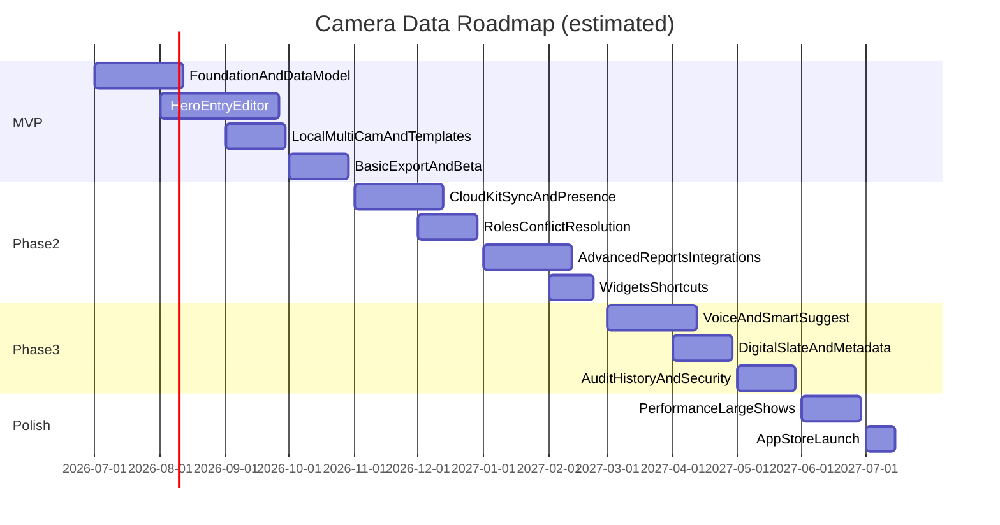
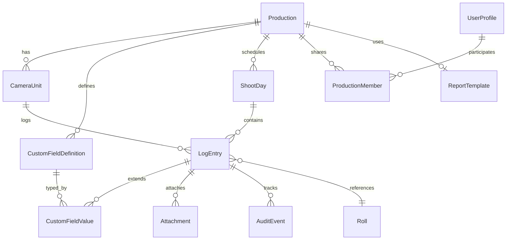
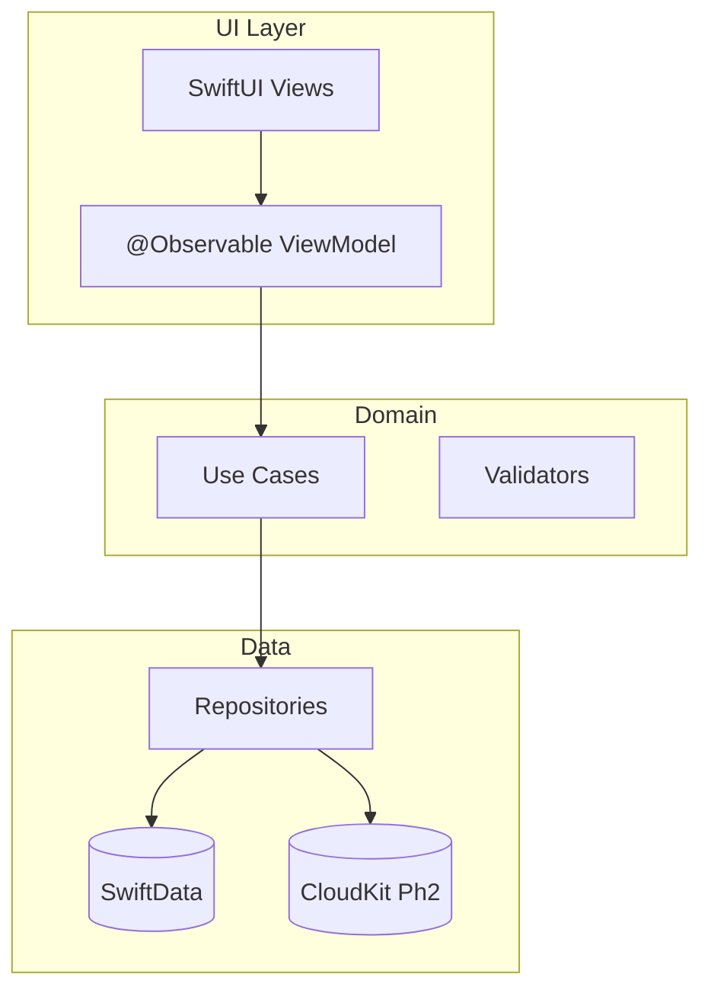

# Camera Data — Comprehensive Development Plan

*A phased architecture for a native iOS/iPadOS (iOS 26+) camera logging app using SwiftUI Liquid Glass, SwiftData + CloudKit, Clean MVVM with @Observable, and a freemium + Pro subscription model.*

## Implementation Status (June 2026)

| Phase | Status | Notes |
|---|---|---|
| **MVP v1.0** | **Complete** | SwiftData, Hero Editor, dashboard, exports, onboarding, Liquid Glass UI |
| **Phase 2** | **Complete** | CloudKit private/shared configs, sync engine, presence, roles, conflict UI, widgets, App Intents, Frame.io hooks |
| **Phase 3** | **Complete** | Speech framework voice logging, Core ML SmartSuggest, NLP search, Digital Slate, audit history, security |
| **Polish** | **Complete** | On-set sim tests, batched CloudKit sync, durable offline queue |

**Build:** Xcode 26 · iOS 26+ · 51 unit tests · Simulator verified

**Sync architecture:** SwiftData uses local persistence (`cloudKitDatabase: .none`); custom `SyncEngine` + `CloudKitSyncTransport` handles explicit CK `LogEntry` records, durable offline queue, inbound pull, and conflict resolution UI.

## 1. Executive Vision Summary

**Camera Data** is the camera report app professionals will *want* to open on set — not because they have to, but because logging a take feels faster than handwriting, prettier than a PDF, and safer than a shared spreadsheet.

Where ZoeLog optimizes for keypad speed and MovieSlate for slate integration, Camera Data unifies **speed, beauty, and pipeline-grade data** in one native SwiftUI experience. Built for iOS 26+ Liquid Glass, it feels cinematic in dim soundstages and blazingly fast with gloved thumbs. Offline-first SwiftData storage means a dead cell zone never kills a take log; CloudKit shared zones bring script supervisors, ACs, and VFX into the same live document with presence and sane conflict resolution.

Differentiators that win adoption:
- **Hero Entry Editor** — contextual, haptic-rich, one-thumb logging with SmartFill 2.0 and optional voice
- **Production-grade exports** — VES-aware fields, branded PDFs, CSV/JSON pipelines tuned for Frame.io C2C and DIT tools
- **Flexible schema without chaos** — unlimited custom fields per production, snap-in templates, audit history
- **Intelligence on device** — duplicate detection, lens usage analytics, natural language search (Phase 3)
- **Premium calm UI** — Liquid Glass materials, Night/Red mode, zero visual fatigue across 18-hour days

**Why it wins:** Film crews adopt tools that respect their time and their data. Camera Data respects both — and looks like it belongs on an ARRI monitor, not in a generic productivity category.

---

## 2. Phased Development Roadmap



### MVP — v1.0 Launch Target (~5–6 months, 2–3 engineers)

**Goal:** Solo/small-team logging that already beats ZoeLog on UI and matches core speed.

| Workstream | Deliverables | Complexity |
|---|---|---|
| Foundation | Xcode project, modules, DI, design tokens, SwiftData stack | M |
| Data model | Production, Camera, Day, Entry, CustomField, Roll, Attachment stubs | L |
| Hero Entry Editor | Scene/Take keypad, lens/filter/ISO/shutter/WB/FPS, notes, circling flags | L |
| SmartFill v1 | Rule-based defaults from last entry, per-camera memory, template defaults | M |
| Multi-camera (local) | Camera switcher, per-camera reports, simultaneous split on iPad | M |
| Dashboard | Day view, stats (takes/hour, lens count), filters | M |
| Export v1 | PDF (production layout), CSV, JSON | L |
| Offline-first | Full local persistence, no network required | M |
| Onboarding | Template picker, 60-second first take | S |
| Liquid Glass UI | Dark cinematic theme, tab/sheet/toolbar glass, haptics | L |

**MVP explicitly defers:** CloudKit sync, presence, roles, voice, ML, Frame.io API, Digital Slate, GPS/gyro, audit history, widgets.

**Dependencies:** iOS 26 SDK for full Liquid Glass; fallback `Material.regular` path for iOS 18–25 if supporting older OS (recommend **iOS 26+ only** at launch to avoid split design systems).

---

### Phase 2 — Collaboration & Exports (~3–4 months)

| Workstream | Deliverables |
|---|---|
| CloudKit sync | Private + shared CKDatabase, CKShare invites (QR, link, production code) |
| Presence | “Sarah is editing Take 4” via lightweight heartbeat records |
| Conflict resolution | Last-writer-wins default + merge UI for critical fields |
| Roles | Admin, Editor, Read-only, VFX-only filtered views |
| Production templates | Clone fields, cameras, defaults across shows |
| Advanced PDF | Branding, crew credits, auto layout, Liquid Glass preview renderer |
| Pipeline exports | VES-style field maps, Frame.io C2C webhook/export hooks |
| Daily wrap | Shareable summary PDF + message/email sheet |
| Widgets + Shortcuts | “Log take”, “Open today”, Siri App Intents |

**Dependencies:** MVP data model must include `syncVersion`, `lastModifiedBy`, `deviceId` from day one.

---

### Phase 3 — Intelligence & Differentiation (~3–4 months)

| Workstream | Deliverables |
|---|---|
| SmartSuggest 2.0 | On-device Core ML / Create ML from crew patterns |
| Voice-to-log | Speech + Apple Intelligence + film terminology lexicon |
| NLP search | “All anamorphic takes scene 12 last week” across projects |
| Digital Slate Mode | Optional full-screen slate + auto-increment take |
| Rich metadata | GPS, gyro/orientation, attachment EXIF, timecode fields |
| Timecode mastery | Multiple sources, offsets, jam-sync UI (hardware hooks stubbed) |
| Audit/version history | Per-field change log, restore |
| Security | Face ID / Touch ID, optional production PIN, encrypted CloudKit fields |

---

### Polish & Ongoing

- Large-dataset profiling (10k+ entries): pagination, indexed fetch, background PDF generation
- Night/Red mode refinement, accessibility audits
- Localization (EN first; DE/FR for European crews in Phase 2+)
- TestFlight → union AC / script supervisor beta cohorts
- App Store screenshots, press kit, IATSE-adjacent community outreach

---

## 3. Data Model Design

### Entity Relationship Overview



### Core SwiftData Entities

#### `Production`
- `id: UUID`, `name`, `code` (invite), `createdAt`, `archivedAt`
- `defaultTemplateId`, `branding: ProductionBranding` (logo, colors, credits block)
- `settings: ProductionSettings` (VES profile, timecode mode, field visibility)
- `syncMetadata: SyncMetadata` (CK record name, share URL, revision)
- Relationships: `cameras`, `days`, `customFields`, `members`, `template`

#### `CameraUnit`
- `id`, `label` (A, B, C), `sortOrder`, `defaultReportType`
- Per-camera defaults: `defaultLens`, `defaultISO`, `defaultFPS`, etc.
- `isActive` for multi-unit shoots

#### `ShootDay`
- `id`, `date`, `dayNumber`, `locationName`, `notes`
- Aggregates: computed `takeCount`, `firstShot`, `lastShot` (cached for dashboard)

#### `LogEntry` (hero entity)
- **Identity:** `id`, `scene`, `take`, `setup` (optional), `sortKey` (scene+take composite for ordering)
- **Camera report core:** `lens`, `filter`, `iso`, `shutterAngle`, `shutterSpeed`, `whiteBalance`, `fps`, `resolution`, `codec`, `rollId`, `timecodeIn`, `timecodeOut`, `duration`
- **Status flags:** `isCircled`, `isMOS`, `isPickup`, `isTail`, `isHold`, `isBad`, `isSeries`
- **Notes:** `notes`, `scriptNotes`, `vfxNotes` (role-filtered in VFX view)
- **Sync:** `modifiedAt`, `modifiedBy`, `syncVersion`, `isDeleted` (soft delete)
- **Geo/motion (Phase 3):** `latitude`, `longitude`, `altitude`, `deviceOrientation`, `captureContext`
- Relationships: `camera`, `day`, `production`, `customValues`, `attachments`, `auditTrail`

#### `CustomFieldDefinition`
- `id`, `key`, `label`, `fieldType` (text, number, picker, bool, date, timecode)
- `pickerOptions: [String]`, `defaultValue`, `isRequired`, `sortOrder`
- `scope` (production / global), `visibilityRoles` (all, VFX-only, etc.)

#### `CustomFieldValue`
- `id`, `stringValue`, `numberValue`, `boolValue`, `dateValue`
- Relationship: `definition`, `entry` — **unique pair** `(entryId, definitionId)`

#### `Roll`
- `id`, `rollNumber`, `mediaType`, `capacity`, `remaining`, `labRoll`, `cameraId`

#### `Attachment`
- `id`, `type` (photo, video, reference), `localURL`, `ckAsset`, `thumbnailURL`
- `exifJSON`, `capturedAt`, `fileSize`

#### `ReportTemplate`
- `id`, `name`, `layoutJSON`, `includedFields`, `headerFooter`, `isSystemTemplate`

#### `ProductionMember`
- `id`, `userId`, `role` (admin, editor, readOnly, vfx)
- `displayName`, `joinedAt`, `presenceState` (ephemeral, CloudKit or separate store)

#### `AuditEvent` (Phase 3)
- `id`, `entryId`, `fieldKey`, `oldValue`, `newValue`, `userId`, `timestamp`, `deviceId`

### SwiftData + CloudKit Considerations

| Concern | Strategy |
|---|---|
| Record size | Keep `LogEntry` flat for core fields; custom values in child table |
| Ordering | `sortKey` string + `modifiedAt` tiebreaker; index in SwiftData `#Index` |
| Sharing | One CKShare per `Production`; child records in shared zone |
| Conflicts | Field-level `syncVersion`; merge UI compares `AuditEvent` trail |
| Attachments | CKAsset with background upload queue; thumbnail local-first |
| Migrations | Lightweight versioning via `schemaVersion` on Production |
| Search | Spotlight indexing + Phase 3 embedding index for NLP |
| Soft delete | `isDeleted` + 30-day purge job |

**Critical MVP decision:** Add `SyncMetadata` and `syncVersion` on `LogEntry` in MVP even before CloudKit ships — avoids painful migration.

---

## 4. Key Screens & Flows

### 4.1 Production / Camera Dashboard

**Narrative:** User lands on active production. Top: production name + day selector (horizontal glass chips). Center: camera tabs (A / B / C) as segmented glass control. Below: scrollable take list with scene/take badges, circling indicator, lens thumbnail text, time-of-log.

**Liquid Glass treatment:**
- `NavigationStack` with glass toolbar; production switcher in `toolbarTitleMenu`
- Floating `GlassEffectContainer` action button: **+ Log Take** (primary haptic)
- Stats row in translucent cards: takes today, circled count, dominant lens
- iPad: `NavigationSplitView` — camera list | day list | entry list

**Gestures:** Swipe entry → duplicate / circle / delete; long-press → quick edit lens/ISO.

---

### 4.2 Entry Editor (Hero Screen)

**Narrative:** The heart of the app. Opens full-screen (iPhone) or inspector column (iPad). Scene and Take are oversized glass keypad fields — auto-advance on valid input. Lens and ISO as horizontal picker rails with SmartFill highlights. One tap **Log & Next** commits, increments take, carries forward smart defaults.

**Liquid Glass treatment:**
- `glassEffect(.regular.interactive())` on keypad keys
- Contextual “suggested” chips pulse subtly when SmartFill has confidence
- Bottom sheet (glass) for advanced fields (shutter, WB, filter, roll, timecode)
- Circling: satisfying toggle with `.sensoryFeedback(.success)`
- Attachment strip: glass thumbnails, camera capture shortcut

**Flow:** Dashboard → tap + or row → Editor → Log & Next → returns to dashboard with new row animated in.

**Performance:** Editor view model preloads next take number; save is optimistic (<16ms target).

---

### 4.3 Reports Viewer

**Narrative:** Choose day/camera/range → preview paginated PDF with pinch zoom. Toggle included fields, crew block, branding. Export via share sheet (Files, AirDrop, Frame.io in Phase 2).

**Liquid Glass treatment:** Preview sits on dark cinematic background; controls in floating glass inspector (iPad) or bottom glass toolbar (iPhone). Page thumbnails in glass sidebar.

---

### 4.4 Settings & Templates

**Narrative:** Production settings, custom fields editor (drag reorder), camera defaults, report template picker, export presets, sync status (Phase 2), Night/Red mode toggle.

**Liquid Glass treatment:** Grouped `Form` with glass section backgrounds; template gallery as visual cards with mini PDF preview.

---

### 4.5 Search & History

**Narrative:** Universal search from dashboard toolbar. MVP: keyword + filters (scene, lens, circled, date). Phase 3: natural language bar.

**Liquid Glass treatment:** Search field expands from toolbar glass capsule; results in grouped list with highlight matches; recent searches as chips.

---

## 5. Feature Prioritization Matrix

| Feature | v1.0 Must-Have | Strong Differentiator | Future |
|---|---|---|---|
| Hero Entry Editor + haptics | ✓ | | |
| Core camera report fields | ✓ | | |
| Custom fields (production) | ✓ | | |
| SmartFill v1 (rule-based) | ✓ | | |
| Multi-camera local | ✓ | | |
| Offline SwiftData | ✓ | | |
| Cinematic dark + Liquid Glass | ✓ | | |
| PDF / CSV / JSON export | ✓ | | |
| Production templates (basic) | ✓ | | |
| Dashboard stats | ✓ | | |
| CloudKit real-time sync | | ✓ (Ph2) | |
| Presence indicators | | ✓ (Ph2) | |
| Role-based access | | ✓ (Ph2) | |
| Branded PDF + daily wrap | | ✓ (Ph2) | |
| Frame.io / pipeline hooks | | ✓ (Ph2) | |
| Widgets / Shortcuts / Siri | | ✓ (Ph2) | |
| Voice-to-log | | | ✓ (Ph3) |
| ML SmartSuggest 2.0 | | | ✓ (Ph3) |
| NLP search | | | ✓ (Ph3) |
| Digital Slate Mode | | | ✓ (Ph3) |
| GPS + gyro metadata | | | ✓ (Ph3) |
| Audit/version history | | | ✓ (Ph3) |
| Timecode hardware integration | | | ✓ (18–24mo) |
| Mac / visionOS apps | | | ✓ (18–24mo) |

---

## 6. Technical Architecture Recommendations

### Stack (confirmed choices)

- **UI:** SwiftUI (iOS 26+), Liquid Glass (`glassEffect`, `GlassEffectContainer`, glass toolbars)
- **State:** `@Observable` view models, Swift Observation framework
- **Architecture:** Clean MVVM + protocol-based dependency injection ([`Dependencies`](https://github.com/pointfreeco/swift-dependencies) or lightweight custom `Environment` + protocols)
- **Persistence:** SwiftData primary; CloudKit via `ModelConfiguration(cloudKitDatabase: .automatic)` in Phase 2
- **Concurrency:** Swift 6 strict concurrency; `@MainActor` view models; `actor` for `SyncEngine`, `ExportService`, `AttachmentUploader`
- **PDF:** PDFKit + custom `GraphicsContext` renderer for branded layouts; background `Task` with progress reporting
- **Testing:** XCTest + snapshot tests (point-in-time glass rendering); **on-set simulation** suite — airplane mode, rapid 50-entry burst, glove-sized hit target regression

### Module Structure (Swift Package or Xcode targets)

```
CameraDataApp/
├── App/                    # Entry, DI assembly, deep links
├── DesignSystem/           # Tokens, Glass components, haptics
├── Features/
│   ├── Dashboard/
│   ├── EntryEditor/        # Hero — isolated for perf tuning
│   ├── Reports/
│   ├── Settings/
│   ├── Search/
│   └── Onboarding/
├── Domain/                 # Pure models, validation, SortKey logic
├── Data/                   # SwiftData models, repositories
├── Services/
│   ├── Export/
│   ├── Sync/               # Phase 2
│   ├── Intelligence/       # Phase 3
│   └── Attachments/
└── Tests/
```

### Key Patterns



- **Repository protocol per aggregate:** `LogEntryRepository`, `ProductionRepository`
- **Use cases:** `LogTakeUseCase`, `GenerateReportUseCase`, `ResolveConflictUseCase`
- **Unidirectional data flow within features;** cross-feature via `ProductionSession` observable singleton (scoped to app lifecycle)
- **Feature flags:** `FeatureGate` for Pro tier and phased rollout

### Performance Strategies

- Fetch descriptors with predicates + fetch limits for dashboard (paginate 50 rows)
- `#Index<LogEntry>([\.sortKey, \.productionId])`
- Avoid `@Query` in hero editor — explicit fetch via view model
- Background model context for exports and sync merges
- Image thumbnails downsampled on ingest

### Testing Approach

| Layer | Tests |
|---|---|
| Domain | Sort key, take increment, SmartFill rules, VES field mapping |
| Data | SwiftData in-memory container CRUD, migration smoke |
| UI | Snapshot dark/light/red modes; entry editor keypad flows |
| On-set sim | Offline 500 entries, sync reconciliation fuzz tests |
| Manual beta | Real AC timed trials vs ZoeLog (time-to-log metric) |

---

## 7. UI/UX & Design System Guidance

### Liquid Glass Usage

- **Navigation bars / tab bars:** system glass with increased contrast tint for dark sets
- **Keypads & primary actions:** `.interactive()` glass for tactile depth
- **Sheets:** `presentationBackground(.glass)` with dimmed cinematic scrim behind
- **Lists:** opaque row content on subtle glass backgrounds — **never** full transparency on data-dense rows (readability)
- **Floating Log button:** `GlassEffectContainer` with shadow lift; spring animation on press

### Color & Typography

- **Base:** near-black `#0A0A0C` background; elevated surfaces `#141418`
- **Accent:** single warm amber `#E8A838` for circling / primary CTA (evokes tungsten, visible in low light)
- **Night/Red mode:** desaturate blues; accent → deep red `#C41E3A`; preserve contrast ratios ≥ 7:1 on critical fields
- **Typography:** SF Pro Display for scene/take numerals (rounded variant); SF Pro Text for metadata; Dynamic Type support mandatory
- **Monospaced timecode:** `.monospacedDigit()` everywhere

### Haptics & Motion

- Light impact: field focus; medium: Log & Next; success: circle take; warning: duplicate scene/take detection
- Animations ≤ 300ms; respect `Reduce Motion` — crossfade replaces slide
- No celebratory confetti — professional restraint

### Set-Specific UX Rules

- Minimum tap target **48pt** (glove mode toggle → 56pt)
- Editor operable one-handed on iPhone Pro Max
- High-contrast field focus ring visible in peripheral vision
- Auto-save every keystroke debounced 300ms — **never lose a take**

---

## 8. Risks, Challenges & Mitigations

| Risk | Impact | Mitigation |
|---|---|---|
| CloudKit conflict complexity | Data loss, crew distrust | Field-level versioning; visible merge UI; offline queue with retry |
| PDF fidelity vs HTML competitors | Export rejection by post | Golden-master PDF tests; user-defined layout JSON; print preview |
| 10k+ entry performance | Dashboard jank | Indexed pagination; avoid live `@Query` on full set; perf budget in CI |
| Liquid Glass readability | Eye strain on set | Opaque content layers; Night/Red mode; user-adjustable glass density |
| Adoption inertia (ZoeLog) | Slow growth | Beta with respected ACs; timed trial benchmarks; import from CSV |
| Pro subscription resistance | Revenue shortfall | Generous free solo tier; production trial month; annual discount |
| Attachment storage costs | CK quota blowout | Size limits on free tier; Pro unlimited; aggressive thumbnail strategy |
| Voice/AI misheard terms | Wrong logs | Confirm sheet for voice; custom production vocabulary list |
| App Store category clutter | Discovery | ASO: “camera report”, “script supervisor”, “AC log”; production case studies |

---

## 9. Monetization & Launch Strategy

### Model (confirmed: Freemium + Pro subscription)

| Tier | Price (suggested) | Includes |
|---|---|---|
| **Free** | $0 | 1 active production, unlimited local entries, basic PDF/CSV, 2 cameras, local templates |
| **Pro Monthly** | $9.99/mo | Unlimited productions, CloudKit sync + presence, roles, branded PDF, Frame.io export, widgets, attachments |
| **Pro Annual** | $79.99/yr | Same as monthly (~33% off) |
| **7-day Pro trial** | — | Full collab on first production (hook for whole team) |

**Team expansion:** Admin invites don't require all members to pay — **production owner** Pro unlocks shared zone (ZoeLog-style team value).

### App Store Positioning

- Category: Productivity (primary), Photo & Video (secondary)
- Subtitle: *“Camera reports, reimagined.”*
- Screenshots: dark set imagery, iPad split view, PDF preview, sync presence mock
- Keywords: camera report, slate log, script supervisor, AC log, ZoeLog alternative

### Launch & Traction

1. **Private beta (8 weeks):** 5–10 working ACs + 3 script supervisors; measure time-to-log vs incumbent
2. **Import wizard:** CSV column mapping from ZoeLog exports
3. **Community:** r/cinematography, Facebook AC groups, local 600 IATSE demos
4. **Partnerships:** rental houses preload on kit iPads; discount codes on Pro annual
5. **v1.0 PR:** “Built by crew, for crew” — short demo reel on set

---

## 10. Future Vision (18–24 Months)

| Horizon | Initiatives |
|---|---|
| **Q3 2027** | Mac Catalyst or native macOS app for prep/wrap in editorial |
| **Q4 2027** | visionOS spatial dashboard — floating take cards around virtual monitor (read-mostly) |
| **2028** | Hardware: LTC timecode via USB/audio interfaces; ARRI / Teradek metadata bridge research |
| **2028** | AI co-pilot: “Prep tomorrow’s likely lenses from today's pattern”; anomaly alerts (ISO drift, duplicate rolls) |
| **2028** | Enterprise: SSO, studio MDM deployment, custom VES studio profiles |
| **Ongoing** | watchOS complication for take count; Live Activities for active shoot day |

---

## 11. Suggested First Implementation Sprint (Post-Approval)

When execution begins in this workspace:

1. Initialize Xcode 26 project — universal iOS/iPadOS, Swift 6, SwiftData
2. Implement `DesignSystem` module (glass button, glass keypad key, theme tokens)
3. Model `Production`, `CameraUnit`, `ShootDay`, `LogEntry`, `CustomFieldDefinition` in SwiftData
4. Build `EntryEditor` feature with mock SmartFill and Log & Next loop
5. Wire `Dashboard` with `@Query` pagination prototype
6. Add basic PDF export for single day / single camera

This sequence validates the riskiest UX assumption — **logging speed + delight** — before CloudKit complexity.

## Todos

- [ ] **foundation** — Scaffold Xcode 26 universal app: Swift 6, SwiftData, DesignSystem module, DI container, feature module structure
- [ ] **data-model** — Implement core SwiftData entities (Production, CameraUnit, ShootDay, LogEntry, CustomField*) with sync metadata stubs and indexes
- [ ] **hero-editor** — Build Entry Editor: glass keypad, SmartFill v1, Log & Next loop, haptics, auto-save
- [ ] **dashboard** — Build Production/Camera dashboard with paginated take list, stats row, multi-camera switcher
- [ ] **export-v1** — Implement PDF/CSV/JSON export pipeline with VES-default field map
- [ ] **mvp-beta** — Onboarding, templates, on-set simulation tests, TestFlight beta with ACs
- [ ] **cloudkit-sync** — Phase 2: CloudKit shared zones, presence, roles, conflict resolution UI
- [ ] **advanced-exports** — Phase 2: Branded PDF renderer, daily wrap, Frame.io C2C hooks, widgets/Shortcuts
- [ ] **intelligence** — Phase 3: Voice-to-log, ML SmartSuggest, NLP search, audit history, Digital Slate, GPS/gyro
